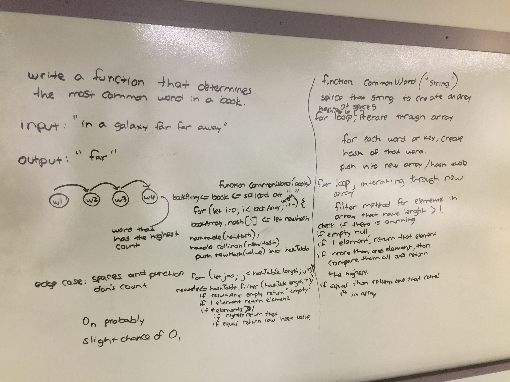

# Hashtables

## DSA Hash Tables
Implement a Hashtable with the following methods:

add: takes in both the key and value. This method should hash the key, and add the key and value pair to the table, handling collisions as needed.
get: takes in the key and returns the value from the table.
contains: takes in the key and returns a boolean, indicating if the key exists in the table already.
hash: takes in an arbitrary key and returns an index in the collection.

## Approach & Efficiency
<!-- What approach did you take? Why? What is the Big O space/time for this approach? -->

## API
.add()
.get()
.contains()
.hash()

# Hashtables

## Repeated Word
Write a function that accepts a lengthy string parameter.
Without utilizing any of the built-in library methods available to your language, return the first word to occur more than once in that provided string.

## Approach & Efficiency
O of n

##

# Hashtables

## Tree Interection
Write a function called tree_intersection that takes two binary tree parameters.
Without utilizing any of the built-in library methods available to your language, return a set of values found in both trees.

## Approach & Efficiency
<!-- What approach did you take? Why? What is the Big O space/time for this approach? -->

##

# Hashtables

## Left Join
Write a function that LEFT JOINs two hashmaps into a single data structure.
The first parameter is a hashmap that has word strings as keys, and a synonym of the key as values.
The second parameter is a hashmap that has word strings as keys, and antonyms of the key as values.
Combine the key and corresponding values (if they exist) into a new data structure according to LEFT JOIN logic.
LEFT JOIN means all the values in the first hashmap are returned, and if values exist in the “right” hashmap, they are appended to the result row. If no values exist in the right hashmap, then some flavor of NULL should be appended to the result row.
The returned data structure that holds the results is up to you. It doesn’t need to exactly match the output below, so long as it achieves the LEFT JOIN logic.
Avoid utilizing any of the library methods available to your language.

## Approach & Efficiency
<!-- What approach did you take? Why? What is the Big O space/time for this approach? -->

##

