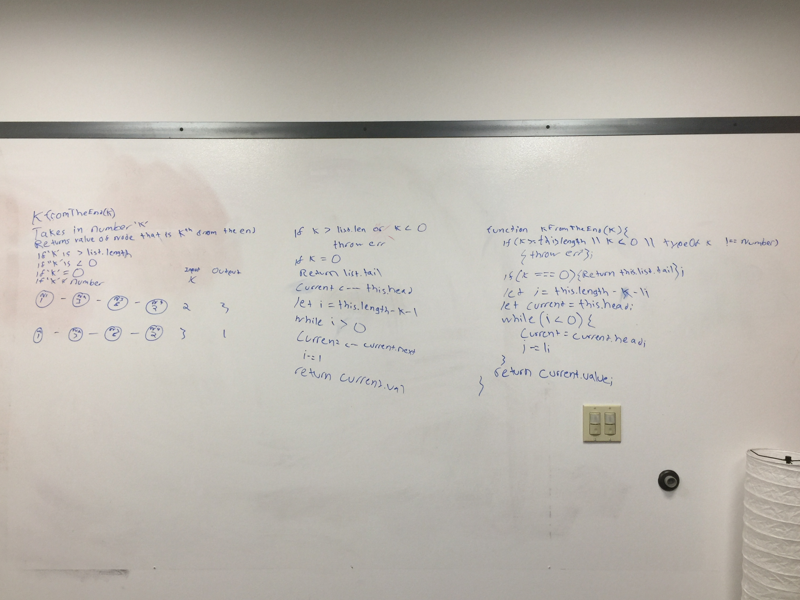

# Singly Linked List

## DSA Implementation: Linked Lists

Create a Node class that has properties for the value stored in the Node, and a pointer to the next Node.

Writes the following methods for the Linked List class:

* .insert(value) which takes any value as an argument and adds a new node with that value to the head of the list with an O(1) Time performance.
* .includes(value) which takes any value as an argument and returns a boolean result depending on whether that value exists as a Node’s value somewhere within the list.
* .toString() which takes in no arguments and returns a string representing all the values in the Linked List.

### Approach & Efficiency

Will be working with an O of n.

### API

N/A

### Whiteboard

N/A

### Link to Code

## Challenge-06

Write the following methods for the Linked List class:

* .append(value) which adds a new node with the given value to the end of the list
* .insertBefore(value, newVal) which add a new node with the given newValue immediately before the first value node
* .insertAfter(value, newVal) which add a new node with the given newValue immediately after the first value node

### Approach & Efficiency

Will be working with an O of n.

### API

N/A

### Whiteboard

### Link to Code

## Challenge-07

* Write a function that takes in a number 'k' and returns a value fo node that is kth frm the end.

### Approach & Efficiency

Will be working with an O of n.

### API

N/A

### Whiteboard

### Link to Code

* [code](https://github.com/adrienneeaston/data-structures-and-algorithms/pull/32)

