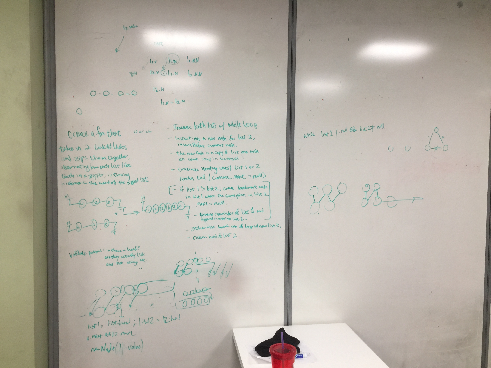

## Challenge-08

* Write a function called mergedLists() that takes in two linked lists, merges them together as a zipper, and returns the reference to the head.

### Approach & Efficiency

Still learning this... <!-- What approach did you take? Why? What is the Big O space/time for this approach? -->

### API

N/A

### Whiteboard

### Link to Code

* [code](https://github.com/adrienneeaston/data-structures-and-algorithms/pull/37/)