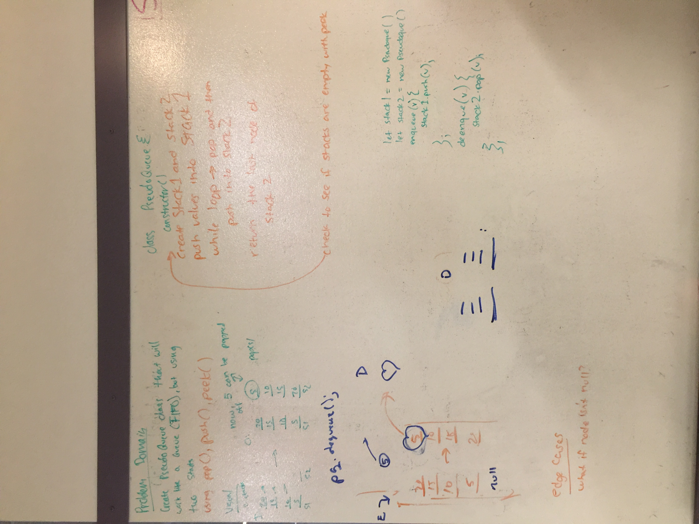

## Challenge-08

* Create a brand new PseudoQueue class, not use an existing Queue. Instead, this PseudoQueue class will implement our standard queue interface (the two methods listed below), but will internally only utilize 2 Stack objects. Ensure that you create your class with the following methods:

* enqueue();

* dequeue();

### Approach & Efficiency

Can use pop(), push(), peek() as created previously.

### API

N/A

### Whiteboard

### Link to Code

* [code](https://github.com/adrienneeaston/data-structures-and-algorithms/pull/45)