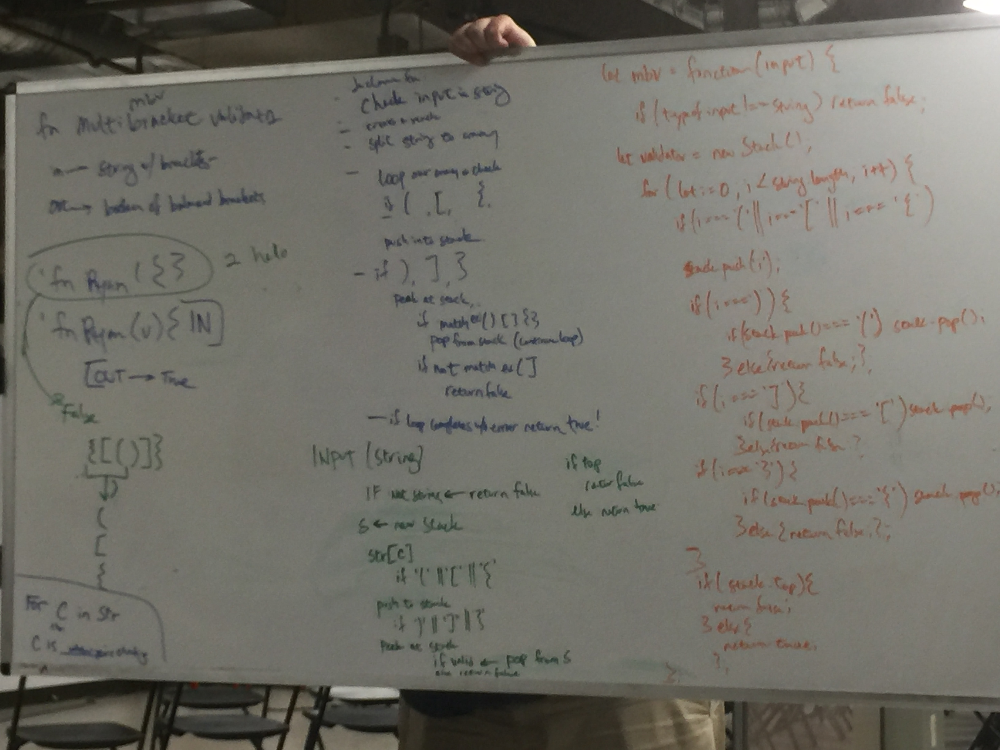

## Challenge-13 - Multibracket Validation

## Challenge Description

On your main file, create a function called multiBracketValidation(input)

Your function should take a string as its only argument, and should return a boolean representing whether or not the brackets in the string are balanced. There are 3 types of brackets:

Round Brackets : ()
Square Brackets : []
Curly Brackets : {}

## Approach & Efficiency
This will be solved with an O of n.

## API
;