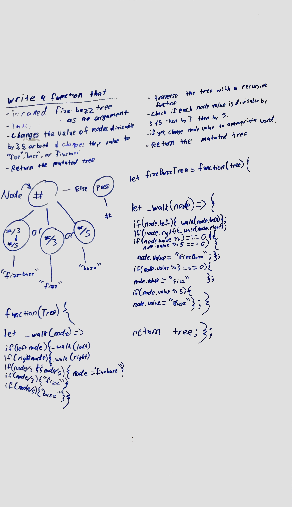
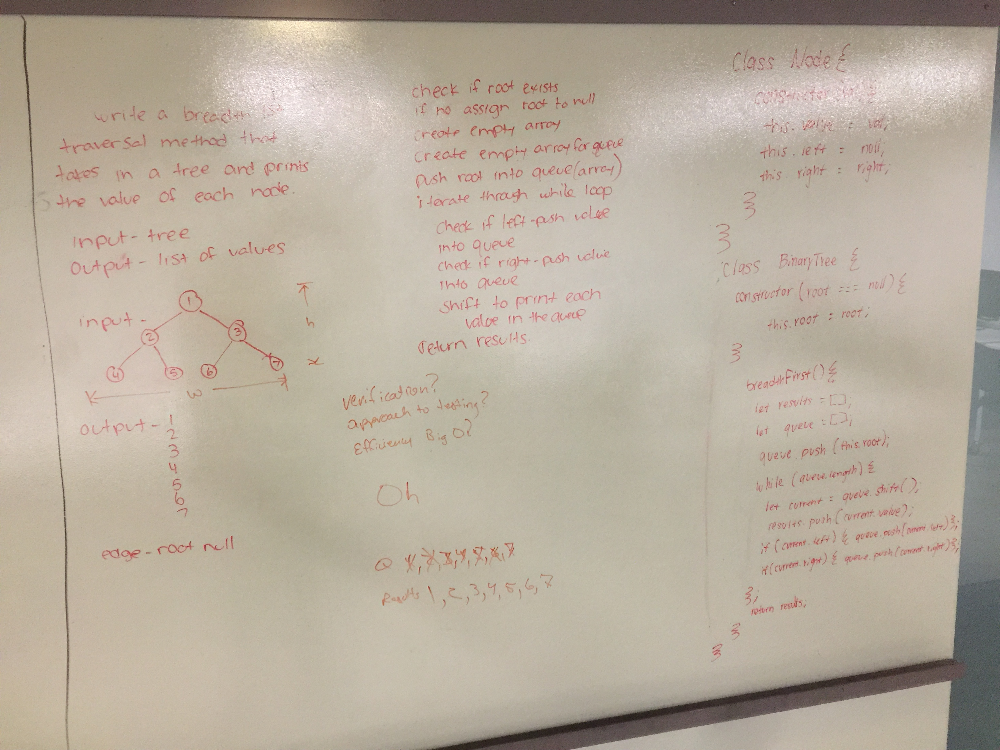
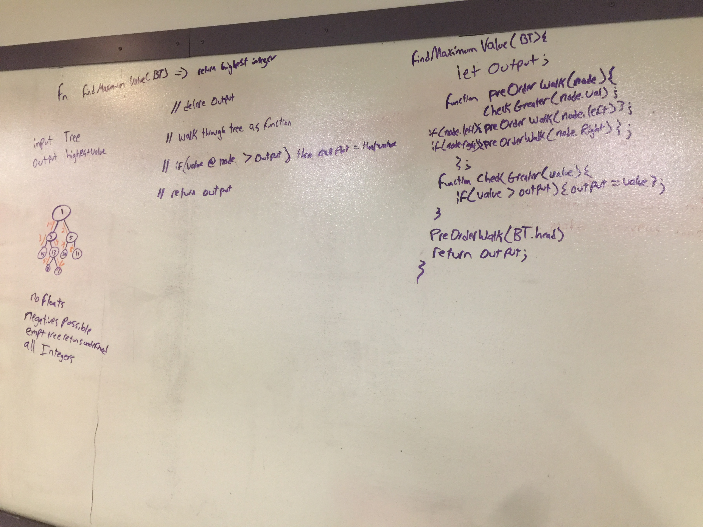

# Trees

A binary tree is a tree data structure in which each node has at most two children, which are referred to as the left child and the right child. A recursive definition using just set theory notions is that a (non-empty) binary tree is a tuple (L, S, R), where L and R are binary trees or the empty set and S is a singleton set. (from Wikipedia)

## Challenge
Create a Node class that has properties for the value stored in the node, the left child node, and the right child node.
Create a BinaryTree class
Define a method for each of the depth first traversals called preOrder, inOrder, and postOrder which returns an array of the values, ordered appropriately.

## Approach & Efficiency
This will be solved with an O(log n).

## API
N/A

# FizzBuzzTree

## Challenge

Write a function called FizzBuzzTree which takes a tree as an argument.
Without utilizing any of the built-in methods available to your language, determine weather or not the value of each node is divisible by 3, 5 or both, and change the value of each of the nodes:
If the value is divisible by 3, replace the value with “Fizz”
If the value is divisible by 5, replace the value with “Buzz”
If the value is divisible by 3 and 5, replace the value with “FizzBuzz”
Return the tree with its new values.

For explicitly-typed languages: Ensure your node values are of type Object, to hold either strings or integers.

## Approach & Efficiency
This will be solved with an O(log n).

## API
;

# Breadth First

## Challenge

Write a breadth first traversal method which takes a Binary Tree as its unique input. Without utilizing any of the built-in methods available to your language, traverse the input tree using a Breadth-first approach;print every visited node’s value.

## Approach & Efficiency
This will be solved with an O of h.

## API
;

# Find Maximum Value

## Challenge

Write a function called find-maximum-value which takes binary tree as its only input. Without utilizing any of the built-in methods available to your language, return the maximum value stored in the tree. You can assume that the values stored in the Binary Tree will be numeric.

## Approach & Efficiency
This will be solved with a time of O of n and space of O of 1.

## API
;